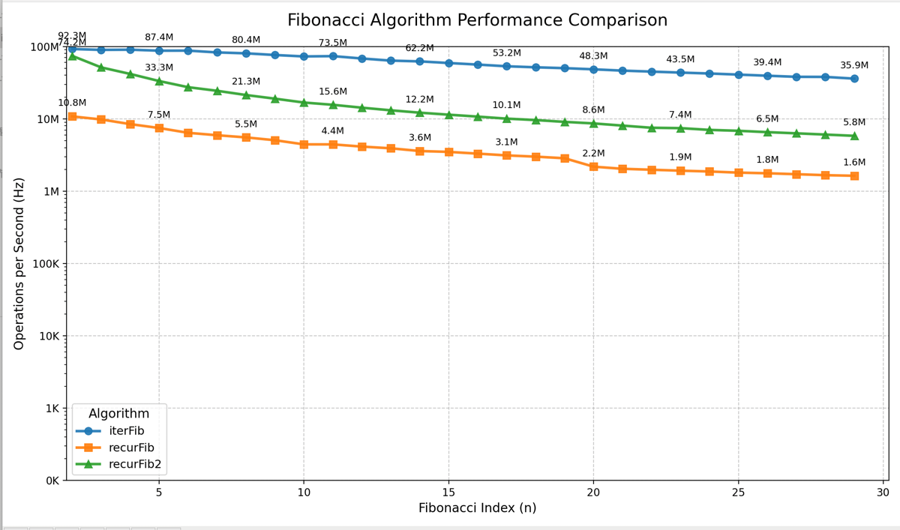

# recurfib
使用动态规划和递归方式求解斐波那契数列
```js
function recurFib(n, memo = {}) {
    // 基础情况：n 为 0 或 1 时直接返回
    if (n < 2) return n;

    // 检查结果是否已缓存
    if (memo[n] !== undefined) {
        return memo[n];
    }
    // 递归计算并缓存结果
    memo[n] = recurFib(n - 1, memo) + recurFib(n - 2, memo);
    return memo[n];
}


function recurFib2(n) {
    function fn(m, result) {
        if (m <= 2) {
            return result + 1;
        }
        return fn(m - 1, result + m)
    }

    return fn(n, 1)
}


function iterFib(n) {
    if (n < 1) return 0;
    let a = 0;
    let b = 1;

    for (let i = 1; i < n; i++) {
        const next = a + b;
        a = b;
        b = next;
    }
    return b;
}
```

## 性能测试

```shell

// 生成测试数据
node index.js

// 用测试数据生成图表
pip install matplotlib
python image.py
```
横坐标为feibonacci数列的第n项，纵坐标为每秒计算次数
次数数值越高说明执行效率越高

